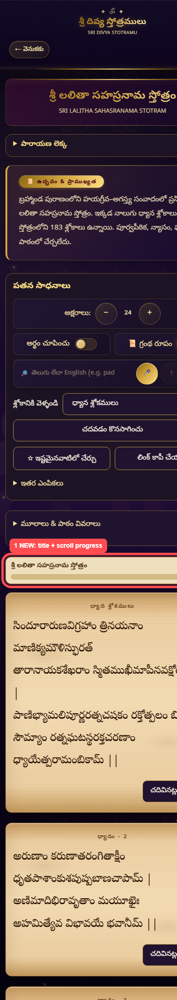
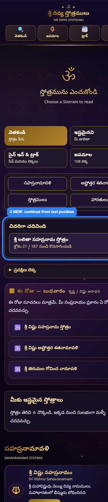
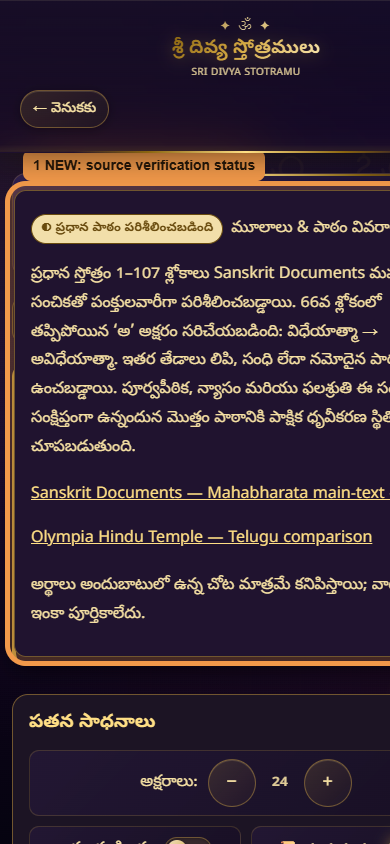
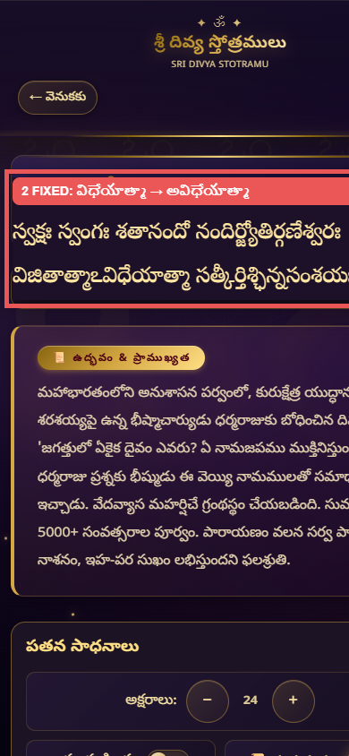

# UI review screenshots

These screenshots use temporary numbered outlines to show what changed. The outlines and labels are review annotations; they are not part of the production interface.

## Phase 5 — reading continuity

### 1. Reader progress strip

**Where:** Below the source-details section and above the first slokam. It remains near the top while the reader scrolls.

**What to test:**

1. Open any stotram on a phone.
2. Scroll through several slokams.
3. Confirm the title stays visible and the count changes, for example `శ్లోకం 21 / 187`.
4. Confirm the gold progress line fills as the count increases.
5. Close and reopen the stotram, then use **చదవడం కొనసాగించు**.

### 2. Home continuation card

**Where:** On Home, below the category shortcuts.

**What to test:**

1. Read or jump to a later slokam.
2. Return to Home.
3. Confirm **చివరిగా చదివింది** shows the same stotram and position.
4. Tap the card and confirm it returns to that saved slokam.

## Phase 6 — Vishnu text trust

### 1. Source verification status

**Where:** In the Vishnu Sahasranamam reader, inside **మూలాలు & పాఠం వివరాలు**.

**What to test:**

1. Open **శ్రీ విష్ణు సహస్రనామ స్తోత్రం**.
2. Scroll below the reading tools.
3. Confirm the badge says **ప్రధాన పాఠం పరిశీలించబడింది**.
4. Expand the section and confirm both comparison sources are listed.

### 2. Corrected verse 66

**Where:** Vishnu Sahasranamam, verse 66.

**What to test:**

1. Use the verse selector to go to verse 66.
2. Confirm the first line contains **విజితాత్మాఽవిధేయాత్మా**.
3. Confirm the number **66** appears once on the right.
